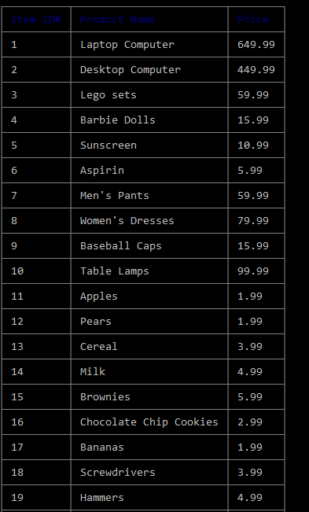
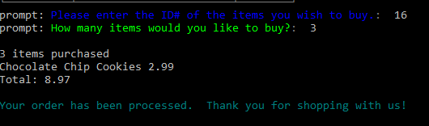
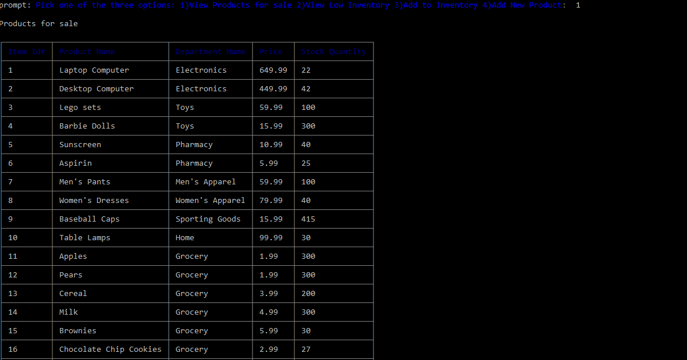
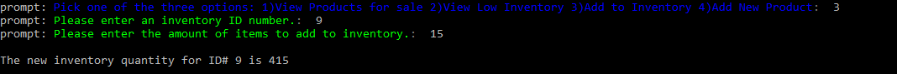
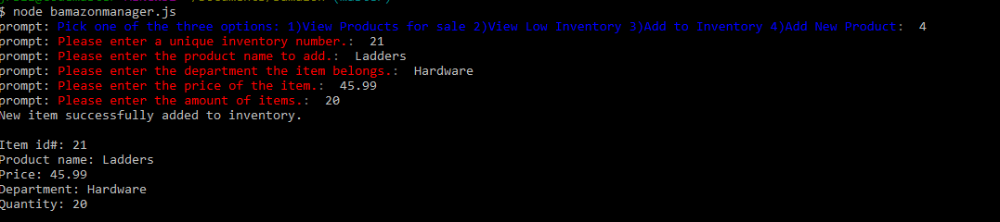
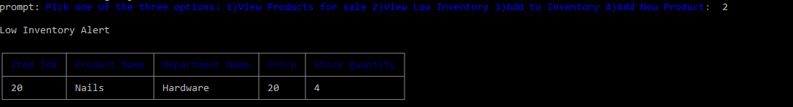

# bamazon
<h1>Welcome to the Bamazon Storefront<h1>

### Summary
***
Bamazon Storefront is a Node.js app that uses MYSQL to purchase items as a customer and track inventory as a manager.

### Bamazon Customer App
***
The Customer app allows users to view items for sale. The user is asked for an item ID# and amount of items they wish to purchase. If there is enough of the item in inventory, the user will see the completed transaction.

### Bamazon Manager App
***
The Manager app allows managers to view current inventory, add to inventory, create a new item for sale, and see low inventory alerts.

### Technologies used
***
Javascript
nodeJS
MySQL
NPM: prompt, mysql, colors, cli-table
